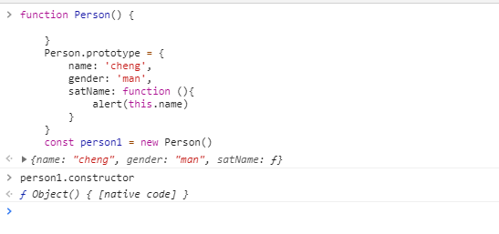

# 面向对象的程序设计

## 1.构造函数模式

</br>

ECMAScript 中的构造函数可用来创建特定类型的对象, 像 Object 和 Array 这样的原生构造函数，在运行时会自动出现
在执行环境栈。 此外，也可以创建自定义的构造函数

```js
    function Person (name, gender) {
        this.name = name
        this.gender = gender
        this.sayName = function () {
            alert(this.name)
        }
    }
    const person1 = new Person ('z', 'lady')
    const person2 = new Person ('cheng', 'man')
```

上面代码直接将属性和方法赋值给了this 对象，并且这里函数名Person 首字母需要大写已区别 ECMAScript
的其他函数，并且分别保存了一个 Person 的实例，这两个对象都有一个 constructor 属性指向Person (原型对象上的constructor)

创建一个新实例 需要 new 操作符

```sh
    1. 创建一个新对象
    2. 将this 指向新的实例 （将构造函数的作用域赋给新对象）
    3. 执行构造函数中的代码 （为这个新对象添加属性和方法）
    4. 返回新对象
```

```js
    person1.constructor == Person // true
    person2.constructor == Person // true
```

检测对象类型 instanceof 操作符

```js
    person1 instanceof Person // true
    person2 instanceof Person // true
    person1 instanceof Object // true 所有对象均继承自Object
    person2 instanceof Object // true
```

### 1.将构造函数作为普通的函数

构造函数与其他函数的区别在于调用函数的方式不同。如果不使用new 操作符调用那么就是普通的函数

### 2.构造函数的问题

使用构造函数的问题就是：每一个方法都要重新在实例上创建一遍，person1 和 person2 都有一个名为 sayName()
的方法，但是那2个方法不是同一个Function 实例。ECMAScript中 函数就是对象，因此没每定义一个函数就是实例化了一个对象。上面的代码亦可以这样定义

```js
    function Person (name, gender) {
        this.name = name
        this.gender = gender
        this.sayName = new Function ()
    }
    const person1 = new Person('cheng')
    const person2 = new Person('cheng')
    person1.name === person2.name // true
    person1.sayName === person2.sayName // false
```

上面的代码问题引出了原型模式(以此解决构造函数的问题)

## 2.原型模式

红宝书P147 这样描述的：

    我们创建的每一个函数都有一个 Prototype （原型）属性，这个属性是一个指针，指向一个对象
而这个对象的用途是包含可以有特定类型的所有实例共享的属性和方法。通过字面量意思来理解，那么
Prototype 就是通过调用构造函数而创建的哪个对象实例的原型对象。使用原型对象的好处是可以让所有
对象实例共享它所包含的属性和方法

```js
    function Person () {

    }
    Person.prototype.name = 'cheng'
    Person.prototype.gender = 'man'
    Person.prototype.sayName= function () {
        alert(this.name)
    }
    const person1 = new Person()
    const person2 = new Person()

    person1.name === person2.name // true
    person1.sayName === person2.sayName // true
```

上面的代码中 将name, gender, sayName 添加到了Person 的原型对象的属性中，构造函数变成空函数，即使如此，
任然可以通过构造函数来创建新对象，而且新对象依然具有想同的属性和方法。但是这些属性和方法是所有实例
所共享的。

### 1.理解原型对象

无论什么时候，只要创建一个新函数，就会根据一组特定的规则为该函数创建一个 prototype 属性，这个属性指向
函数的原型对象。默认情况下，所有的原型对象自动获得一个 constructor（构造函数）属性


上面的图片很好的解释了第一段描述

前面 person1 instanceof Object // true 说明她也是对象的实例 继承Object 的方法。这也就可以说为什么实例的对象有toString() 等方法了(通过原型链继承来的)

调用构造函数创建一个实例后，该实例内部包含一个指针，指向构造函数的原型对象，这个指针是 __proto__ 这个连接
存在与实例和原型之间而不是存在与实例与构造函数之间

判断是实例和对象原型之间是否存在关系 isPrototypeOf() 方法

```js
    Person.prototype.isPrototypeOf(person1) // true
```

上面的代码是person1 内部有一个指针指向 Person.prototype

ES6 有一个方法 Object.getPrototypeOf() 获得对象的原型对象 也就是__proto__ 的值

每当代码读取某个对象的某个属性时，都会执行一次搜索，目标是具有给定名字的属性。搜索首先从实例本身开始
，如果在实例中找到给定名字的属性，则返回该属性的值；如果没有找到，则继续按照原型链向上搜索，在原型对象
中找到具有给定属性，则返回改属性值。 **这也就是多个实例共享属性和方法的原理**

    虽然可以通过实例访问到原型对象中的值，但是却不能通过实例改写原型中的值。如果我们在实例中添加一个属性
，而该属性和原型对象中的属性重名，则该属性会屏蔽原型中的哪个属性

```js
    function Person (){

    }
    Person.prototype.name = 'cheng'

    const person1 = new Person()
    const person2 = new Person()
    person1.name = 'zhen'
    alert(person1.name) // zhen
    alert(person2.name) // cheng
    delete person1.name
    alert(person1.name) // cheng
```

上面的代码 首先创建了一个自定义的构造函数，创建这个函数会自动创建一个prototype 属性这个属性指向一个
对象。给这个原型对象添加了一个name 属性 然后又给实例person1 添加了一个属性name 访问person1.name
得到 zhen  访问person2.name 得到 cheng  然后又通过delete 操作符将 person1 实例自身的属性name 给
删除了。再次访问得到 cheng

使用 hasOwnProperty() 方法可以确定属性是存在与实例还是原型中。(这个方法从Object继承来的)

### 2.原型与 in 操作符

有两种方式可以使用in 操作符： 单独使用和 for-in 中使用。单独使用 in 操作符会通过对象访问给定属性时返回
true 无论该属性存在实例还是原型中

```js
    function Person () {

    }
    Person.prototype.name = 'cheng'
    Person.prototype.sayName = function () {
        alert(this.name)
    }
    const person1 = new Person()
    const person2 = new Person()

    person1.hasOwnProperty('name') // false

    'name' in Person1 // true

    person1.name = 'zhen'

    alert(person1.name) // zhen

    person1.hasOwnProperty('name') // true

    delet person1.name

    person1.hasOwnProperty('name') // false
```

### 3.简单的原型语法

上面那样写有一个问题 就是所有想要挂载在原型上的属性或方法 都要 X.protoype.xx 更常见的方法是用
一个包含所有属性和方法的对象字面量来**重写**整个原型对象

```js
    function Person() {

    }

    Person.prototype = {
        name: 'cheng',
        gender: 'man',
        satName: function (){
            alert(this.name)
        }
    }
```

上面的代码中，将Person.prototype 设置为等于一个以对象字面量形式创建的新对象。**新对象** 因ECMAScript
中对象是引用类型(存在堆内存中) prototype 其实只是个指针 只是指向内存中的地址换了所以 **原来的原型对象还是存在的！！)**  对象是怎么来的？ 从构造函数来的! 所以这个 新对象有一个 __proto__ 指向 Object 构造函数的原型
对象 ，而这个原型对象的 constructor 指向 Object

所以这里 constructor 并不是指向 Person 了 而是指向 Object 可以通过如下代码验证下

```js
    function Person() {

    }
    Person.prototype = {
        name: 'cheng',
        gender: 'man',
        satName: function (){
            alert(this.name)
        }
    }
    const person1 = new Person()
    person1.constructor // Object
```

Chrome 测试代码


上面的代码最后[] 里面写的是原生代码

这个问题出现了，解决的话 直接手动将 constructor 指向 Person 就可以了

```js
    function Person() {

    }
    Person.prototype = {
        constructor: Person,
        name: 'cheng',
        gender: 'man',
        satName: function (){
            alert(this.name)
        }
    }
    const person1 = new Person()
    person1.constructor // Person
```

上面这样解决了 constructor 指向的问题但是新的问题出现了  constructor 在原生的情况下是不可以被枚举
的，这样重写了 constructor 是可以枚举的。用ES5 的 Object.defineProperty() 修改属性的默认特性

```js
    Object.defineProperty(Person.prototype, constructor, {
        emumerable: false,
        value: Person
    })
```

上面这个方法接受 3个参数 第一个是属性所在的对象， 属性的名字， 一个描述符对象

### 4.原型的动态性

```js
    const person = new Person()
    Person.prototype.sayName = function () {
        alert('嘿！你这个单身狗')
    }
    person.sayName()
```

上面的代码是这个意思吧，对吧?

```js
    function Person () {

    }
    const person = new Person()
    Person.prototype = {
        name: 'cheng'
    }
    person.name // undefined
```

```js
    function Person () {

    }
    Person.prototype = {
        name: 'cheng'
    }
    const person = new Person()
    person.name // cheng
```

上面的代码只是实例的时机改变的 但是结果确实大相径庭！

第一段 1.先定义了一个构造函数，然后接着按照一组特定的
规则生成一个 prototype 属性  这个指针指向原型对象  2. new 操作符 实例化了一个新对象 在实例化的过程中
会添加一个指向最初原型的[[prototype]] (__proto__) 的指针。所以第一段代码其实有2个原型对象

第二段 差不多意思 只是new 的这个时候 原型已经重写了 所以他的[[prototype]] 指向最初的原型 就是重写后的
原型对象 .name 的时候根据原型链向上搜啊 在重新后的原型对象里面搜到值为 'cheng' 的字符串

## 3.继承

OO语言的继承有2种概念一个是 接口继承一个是实现继承，而JS没有函数
签名所以无法接口继承 只能实现继承(继承实际的方法)

### 1.原型链

原型链是实现继承主要方法。其基本思想是利用原型让一个引用类型继承里一个引用类型的属性和方法

让原型对象等于另一个类型的实例，层层递进构成了原型链

```js
    function SuperType () {
        this.property = true
    }
    SuperType.prototype.getSuperValue = function () {
        return this.property
    }

    function subType () {
        this.property = false
    }

    subType.prototype = new SuperType()

    subType.prototype.getSubValue = function () {
        return this.property
    }
    const instance = new subType()
    instance.getSuperValue() // true
```

上面的定义了两个类型：SuperType 和 subType。每一个类型分别有一个属性和一个方法。它们的区别是subType
继承了SuperType。而继承是通过创建SuperType 实例，并将改实例赋给subType.prototype 。实现的本质是重写
原型对象

#### 1.1 确定原型和实例直接的关系

确定原型和实例之间的关系 第一种方式是使用 instanceof 操作符

```js
    instance instanceof subType // true
    instance instanceof SuperType // true
    instance instanceof Object // true
```

-[instanceof](https://developer.mozilla.org/zh-CN/docs/Web/JavaScript/Reference/Operators/instanceof)

之前只是用，感觉不是很清楚这个操作符。还是有必要捋一遍这个玩意

先说说typeof个人的理解:  typeof 这个操作符(一元运算符，返回一个说明运算符类型的字符串)

```js
    typeof 1 // number
    typeof '1' // string
    typeof true // boolean
    typeof undefined // undefined
    let s = Symbol()
    typeof s // symbol

    typeof null // object 注意

    typeof Object // function
    typeof Array // function
    typeof {} // object
    typeof [] // object
```

typeof 一般用于判断一个变量的类型，我们可以通过 typeof 这个一元操作符判断 string,number,boolean,
null,undefined,function,symbol(es6) 这七种类型。但是在判断 Object 类型的时候只能告诉我们这个是
object类型，不能具体到哪一种类型--如上代码所示

</br>

**最近看到了掘金的一遍文章阐述了为什么 typeof 在判断 null 的时候是显示 object 了**
原文地址 -[typeof](https://juejin.im/post/5b0b9b9051882515773ae714)

就是js 在底部存储变量的时候，会在变量的机器码的低位 1-3位储存其类型信息

+ 000：对象
+ 010：浮点
+ 100：字符串
+ 110：布尔
+ 1：整数

单数 null 和 undefined 这2个有点特殊

null: 所有机器码都是 000

undefin: −2^30

这也就是null被判断为 对象了

---

准确的区分一个对象的类型需要使用 instanceof 操作符

instanceof 运算符。instanceof 要求左边运算符是一个对象右边是一个对象类的名字或者是构造函数

第二种方法是 isPrototypeOf()

```js
    Object.isPrototypeOf(instance) // true
    SuperType.isPrototypeOf(instance) // true
    subType.isPrototypeOf(instance)
```

#### 1.2 定义方法

```js
    function SuperType () {
        this.prototype = true
    }
    SuperType.prototype.getSuperValue = function () {
        return this.prototype
    }
    function SubType () {
        this.prototype = false
    }
    SubType.prototype.getSubValue = function () {
        return this.prototype
    }
    SubType.prototype.getSuperValue = function () {
        return false
    }
    SubType.prototype = new SuperType()
    const instance = new SubType()
    instance.getSuperValue() // false
```

上面的代码第一个方法是添加一个原先不存在的方法，第二个方法是添加一个父类型中已经存在的方法。但是新添加的
方法或者重写的方法需要放到继承的后面

### 2借用构造函数

在子类型的内部调用超类型的构造函数

```js
    function SuperType () {
        this.colors = ['red', 'blue', 'green']
    }
    function SubType () {
        console.log(this) // SubType {}
        SuperType.call(this)
        console.log(this) // SubType {colors: Array(3)}
    }
    const instance1 = new SubType()
    instance1.colors.push('pink')
    console.log(instance1.colors) // SubType {colors: Array(4)}
```

小红书在P 168 页是这么描述的 --

子类型调用超类型的构造函数。