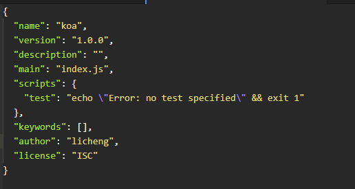

# 安装

koa -- 基于Node.js 平台的的下一代web 开发框架(前端想成为全栈, vue + koa + mogodb )

## window安装需求

koa 是基于node的，所以先需要安装 node.js ,然后是安装koa

```js
    win + r  输入 powershell
    cd desktop
    mkdir koa
    cd koa
```

然后 初始化package.json

```js
    npm init -y
```



上面这张图片是初始化好的package.json 文件,如果按照这样去安装koa 的话，会报错，大致意思是安装的依赖和name重名
，将name:'koa' 改成 name:'koa2'然后安装

```js
    npm install --save koa // 安装默认是 koa2
```

安装好了。

### 新建 index.js

```js
    const Koa = require('koa')
    const app = new Koa()
    app.use(async ctx => {
        ctx.response.body = 'hello world'
    })
    app.listen(3000)
```

启动 node index.js 打开浏览器 看到 hello world

#### 默认返回类型 text/plain

可以通过ctx.response.type 修改

```js
    const Koa = require('koa')
    const app = new Koa()
    app.use(async ctx => {
        ctx.response.type = 'html'
        ctx.response.body = '<h1>hello world</h1>'
    })
    app.listen(3000)
```