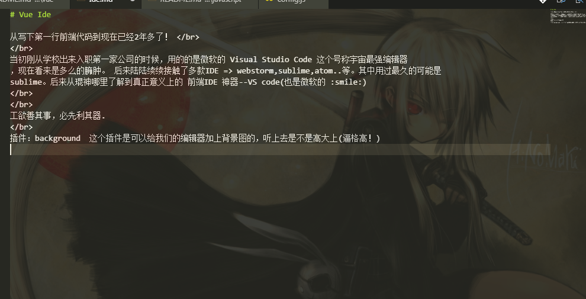
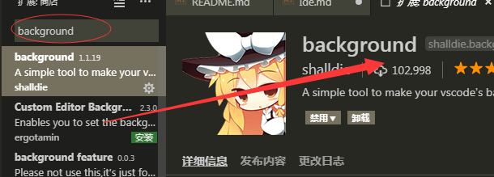

# Vue Ide

从写下第一行前端代码到现在已经2年多了！ </br>
</br>
当初刚从学校出来入职第一家公司的时候，用的的是微软的 Visual Studio 2013这个号称宇宙最强编辑器
，现在看来是多么的臃肿。 后来陆陆续续接触了多款IDE => webstorm,sublime,atom..等。其中用过最久的可能是
sublime。后来从琨神哪里了解到真正意义上的 前端IDE 神器--VS code(也是微软的 :smile:)
</br>
</br>
工欲善其事，必先利其器.
</br>
插件：background  这个插件是可以给我们的编辑器加上背景图的，听上去是不是高大上(逼格高！)

</br>
上面的是效果图，安装见下图


## 代码设置部分

步骤 1: 打开文件 => 首选项 => 设置 选择右侧窗口(左侧窗口是编辑器默认设置区域，右侧是用户自定义区域) 右侧是一个对象结构

```css
    "background.enabled": true, /*是否启用*/
    "background.useDefault": false, /*是否使用默认图片*/
    "background.customImages": [ /*这里是一个数组，可以放3张照片*/
        "file:///C:/c_01.jpg",
        "file:///C:/c_01.jpg"
    ],
    "background.style": { /*CSS样式，这里没的说了*/
        "content": "''",
        "pointer-events": "none",
        "position": "absolute",
        "left":0,
        "z-index": "99999",
        "width": "100%",
        "height": "100%",
        "background-position": "center",
        "background-repeat": "no-repeat",
        "background-size": "100%,100%",
        "opacity": 0.1
    },
```

好了，这个插件设置好了，可以愉快的玩耍了